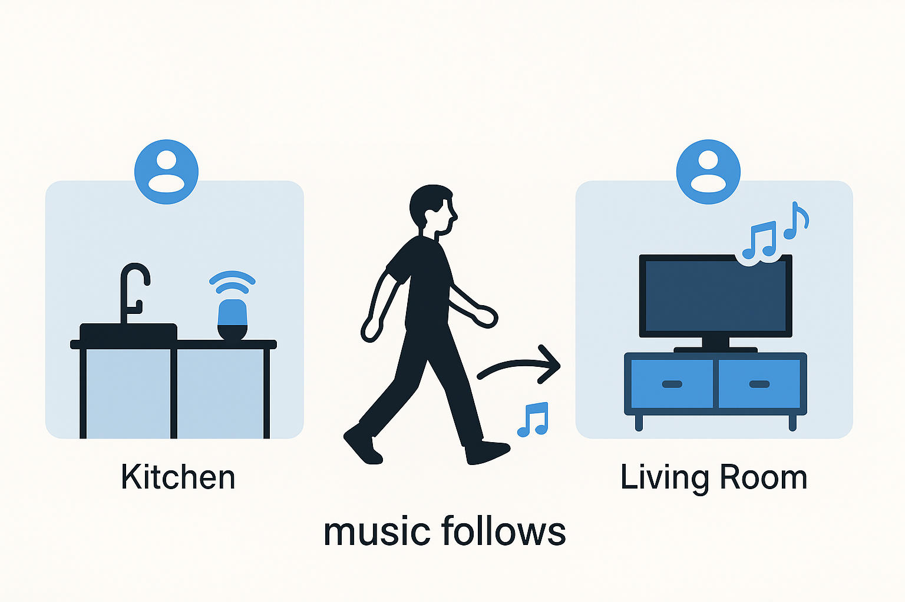

# Auto Grouping Speaker Service (AGS Service)


AGS Service is a custom Home Assistant integration that automatically manages speakers across your home.  It creates a virtual **AGS Media Player** that always points to the best speaker for the active rooms and keeps groups in sync as you move around.  Designed around Sonos and LG TVs but compatible with any media player Home Assistant supports, AGS makes whole‑home audio effortless.

The integration continuously tracks room occupancy and speaker states, regrouping devices on the fly so your music or TV audio follows you.  With sensors, switches and automations built in, AGS can react to schedules, manual overrides and even HomeKit.  Whether you want music in every room or sound that follows you from place to place, AGS handles the heavy lifting.

## Table of Contents
* [Features](#features)
* [File Structure](#file-structure)
* [Installation](#installation)
* [Quick Start](#quick-start)
* [Configuration](#configuration)
* [Automation](#automation)
* [Service Logic](#service-logic)
* [Sensor Logic](#sensor-logic)
* [License](#license)
* [Changelog](#changelog)

## Features

**Virtual AGS Media Player**

* Acts as the master player for the entire system. It automatically points to the best speaker based on room activity and exposes normal media controls (play, pause, volume, source, next/previous). Optionally a second HomeKit‑friendly player can mirror these controls for Apple users.

**Sensors**

* `AGS Service Configured Rooms` – lists every room defined in the configuration.
* `AGS Service Active Rooms` – shows which rooms are currently active according to their media switch and overall status.
* `AGS Service Active Speakers` – the speakers playing in the active rooms.
* `AGS Service Inactive Speakers` – speakers in rooms that are currently inactive.
* `AGS Service Status` – overall system state (`ON`, `ON TV`, `Override`, or `OFF`).
* `AGS Service Primary Speaker` – the speaker chosen as the primary output.
* `AGS Service Preferred Primary Speaker` – backup speaker that will take over if the primary stops playing.
* `AGS Service Source` – name of the media source that will be played when AGS starts playback.
* `AGS Service Inactive TV Speakers` – TV‑related speakers that are currently inactive.

All of the data from these sensors is also available as attributes of the
`media_player.ags_media_player` entity, so you may disable the sensors and still
access their values.

**Switches**

* `(Room Name) Media` – toggle a room on or off manually. One switch is created for every room in your configuration.

## File Structure

The integration consists of several Python modules and support files:

- `custom_components/ags_service/__init__.py` – handles setup and stores configuration data.
- `custom_components/ags_service/ags_service.py` – contains the core logic for tracking rooms and speakers.
- `custom_components/ags_service/media_player.py` – implements the virtual AGS Media Player entity.
- `custom_components/ags_service/sensor.py` – defines optional sensor entities.
- `custom_components/ags_service/switch.py` – defines room switch entities.
- `custom_components/ags_service/manifest.json` – metadata about the integration.
- `custom_components/ags_service/AGS Automation Example.yaml` – ready‑to‑use automation example.
- `custom_components/ags_service/README.md` – this documentation file.

## Installation

### Install with HACS

1. Open **HACS → Integrations → ⋮ → Custom repositories**.
2. Add `https://github.com/ByteRookie/AGS_Service` as a new **Integration** repository.
3. Search for **AGS Service** in HACS and install it.
4. Restart Home Assistant.

### Manual Install

1. Download the `ags_service` folder from this repository.
2. Place it in your `custom_components` directory (create the folder if it does not exist).
3. Add the configuration details to your `configuration.yaml` file (see below).
4. Restart Home Assistant.

## Quick Start

Follow these basic steps to try AGS Service immediately:

1. Install the integration through HACS using the instructions above.
2. Copy the [minimal configuration](#minimal-configuration) into your `configuration.yaml` file.
3. Import `AGS Automation Example.yaml` from this repository via **Settings → Automations** and enable it.

## Configuration

Add the integration to `configuration.yaml`.

### Minimal configuration

Only `rooms` and `Sources` are required:

```yaml
ags_service:
  rooms:
    - room: "Living Room"
      devices:
        - device_id: "media_player.living_room"
          device_type: "speaker"
          priority: 1
  Sources:
    - Source: "Default"
      Source_Value: "1"
      media_content_type: "favorite_item_id"
      source_default: true
```

### Optional parameters

| Parameter | Default | Description |
|-----------|---------|-------------|
| `disable_zone` | `false` | When `true`, AGS ignores `zone.home`. |
| `override_content` | _None_ | Overrides status when a player's `media_content_id` contains the value. |
| `interval_sync` | `30` | Sensor refresh interval in seconds. |
| `schedule_entity` | _None_ | Optional schedule entity. `on_state`/`off_state` default to `on`/`off`; `schedule_override` defaults to `false`. |
| `homekit_player` | `none` | Name for an extra HomeKit player that exposes the same static source list. |
| `create_sensors` | `false` | Expose sensors as entities. |
| `default_on` | `false` | Start enabled on boot. |
| `static_name` | `none` | Custom name for the AGS Media Player. |
| `disable_Tv_Source` | `false` | Hide TV source in the static source list. |
| `ott_device` | _None_ | External player for TVs that use a streaming box or console. AGS pulls play/pause controls from this device when the TV is active (`ON TV`). |

### Reference configuration

```yaml
ags_service:
#  interval_sync: 30
#  disable_zone: true
#  homekit_player: "My HomeKit Player"
#  create_sensors: true
#  default_on: false
#  static_name: "AGS Media Player"
#  disable_Tv_Source: false
#  schedule_entity:
#    entity_id: schedule.my_music
#    on_state: "on"  # optional
#    off_state: "off"  # optional
#    schedule_override: true  # optional
  rooms:
    - room: "Room 1"
      devices:
        - device_id: "media_player.device_1"
          device_type: "tv"
          priority: 1
#          ott_device: "media_player.ott_1"  # optional: streaming box used for playback
        - device_id: "media_player.device_2"
          device_type: "speaker"
          priority: 2
    - room: "Room 2"
      devices:
        - device_id: "media_player.device_3"
          device_type: "tv"
          priority: 3
#          override_content: "bluetooth"
        - device_id: "media_player.device_4"
          device_type: "speaker"
          priority: 4
  Sources:
    - Source: "Top Hit"
      Source_Value: "2/11"
      media_content_type: "favorite_item_id"
      source_default: true
    - Source: "Chill"
      Source_Value: "2/12"
      media_content_type: "favorite_item_id"
    - Source: "Alternative"
      Source_Value: "2/13"
      media_content_type: "favorite_item_id"

```

* **rooms** – list of rooms and their devices. Each device requires `device_id`, `device_type` and `priority`.
* **Sources** – static list of available sources for the AGS Media Player. Mark one entry with `source_default: true` to use when no other source is selected.
* **schedule_entity** – follow another entity's state. `on_state`/`off_state` default to `on`/`off`; `schedule_override` defaults to `false`.
* **homekit_player**, **create_sensors**, **default_on**, **static_name**, **disable_Tv_Source**, and **interval_sync** are optional tweaks. See example for placement.
* If `schedule_override` is enabled, AGS turns off once whenever the schedule switches to its off state but can be manually re-enabled until the schedule turns back on.


HomeKit does not handle the AGS player's dynamically changing name and TV source list. If you plan to expose the player to HomeKit either specify ``homekit_player`` so a dedicated media player with a static name is created, or enable ``static_name`` and set ``disable_Tv_Source: true`` to keep the main player's name and source list constant.


## Automation

AGS Service requires an automation to keep speaker groups in sync. The repository provides **AGS Automation Example.yaml** which you can import directly.

1. Open **Settings → Automations** and create a new automation.
2. Choose **Edit in YAML** and paste the contents of `AGS Automation Example.yaml`.
3. Save, enable the automation and reload your automations.

The automation watches the AGS Media Player sensors and calls join, unjoin and source reset services. Without it the integration will not automatically manage your speakers.

## Service Logic

AGS evaluates several conditions to decide when to play and which speaker should be primary:

1. **update_ags_status** checks if `zone.home` is empty unless `disable_zone` is enabled. If nobody is home the status becomes `OFF`.
2. When a `schedule_entity` is defined the status follows its state. With `schedule_override` disabled the system turns `OFF` whenever the schedule is off.
3. Devices can define `override_content`. When a playing device's `media_content_id` contains this text the service switches to `Override` and that device becomes the primary speaker.
4. If any active room has a TV that is on, status changes to `ON TV`.
5. Otherwise the status is simply `ON`.

`determine_primary_speaker` sorts devices in each active room by priority and picks the first playing speaker. If none are found it immediately falls back to the preferred device.

`execute_ags_logic` uses the sensor data to join active speakers, unjoin inactive ones and reset TV speakers back to the TV source when required.

## Sensor Logic

Each sensor uses specific logic to report the state of the system:

* **AGS Service Configured Rooms** – list of all room names from `rooms` in the configuration.
* **AGS Service Active Rooms** – rooms whose media switch is on.
* **AGS Service Active Speakers** – entity IDs of speakers located in the active rooms.
* **AGS Service Inactive Speakers** – speakers that are currently not playing or in inactive rooms.
* **AGS Service Status** – `ON`, `ON TV`, `Override` or `OFF` based on room activity, schedule and override checks.
* **AGS Service Primary Speaker** – entity ID of the speaker currently acting as the master.
* **AGS Service Preferred Primary Speaker** – next speaker AGS will use if the primary stops.
* **AGS Service Source** – numeric media source value for the selected item.
* **AGS Service Inactive TV Speakers** – speakers attached to TVs that are currently inactive.

## License

This project is released under a Non-Commercial License. See the [LICENSE](LICENSE) file for details.

# Changelog

### v1.3.6
- Restored the TV source reset when a room turns off
- Delay the source change slightly so the unjoin completes without errors
- Final-room shutdown still uses `media_stop`

### v1.3.7
- Removed the one second delay before resetting TV speakers
- Skip `media_stop` when the last active room has a TV

### v1.3.5
- Removed the pre-action sensor refresh for join/unjoin

### v1.3.3
- Ensured playlist clears when the last room turns off
- Join action now falls back to the preferred primary speaker

### v1.3.2
- Added optional `AGS Actions` switch when sensors are enabled
- Room switches now directly join/unjoin speakers
- Turning the final room off also pauses and clears its playlist
- Removed the primary speaker retry delay

### v1.3.0
- Added schedule entity support and auto-start when the schedule turns on
- Configurable sensor refresh interval and other optional settings
- Improved source handling when TVs are active
- Numerous bug fixes and performance tweaks

### v1.2.7
- All configuration options now functional
- Speaker join/leave logic handled in the automation file

### v1.2.6
- New options like `homekit_player`, `static_name`, `create_sensors`, `disable_zone`, `default_on`, `disable_Tv_Source` and `primary_delay`
- Updated automation file and removed obsolete files

### v1.2.5
- Began migrating join and reset actions into Python services
- Updated autoplay and source selection

### v1.2.4
- Sensor updates tied to the media player
- Removed dedicated media player switch and old source dropdown
- Sensor file optional when automation is disabled

### v1.2.3
- Initial HomeKit media player support

### v1.2.2
- Sensor data added as attributes on the media player
- Experimented with forcing TV media type

### v1.2.1
- Device priority logic and seek support
- Player name shows system status and active room count
- Source list switches to device sources when TV is on

### v1.2.0
- Introduced the AGS Media Player entity

### v1.1.0
- Primary speaker delay option
- Switches retain state across reboots
- Added the first automation file

### v1.0.11
- Initial public release
