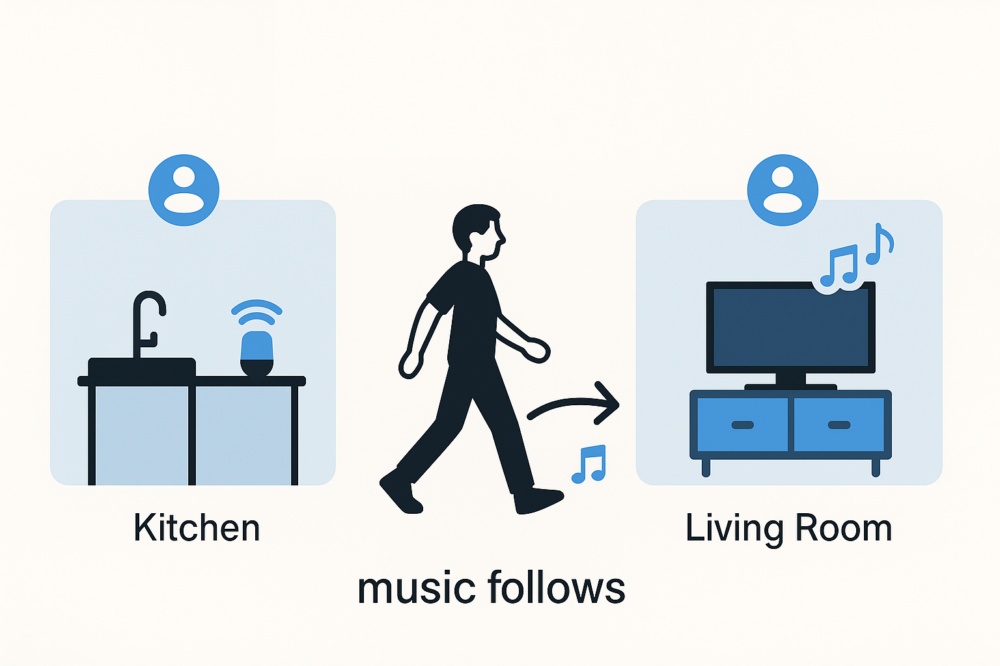

# Auto Grouping Speaker Service (AGS Service) V2


AGS Service is a custom Home Assistant integration that automatically manages speakers across your home. V2 introduces a modern, UI-driven configuration and advanced cascading orchestration.

## Features (New in V2)

**UI-Driven Configuration**
* Stop editing YAML. AGS now features a dedicated **Custom Panel** in the Home Assistant sidebar for real-time orchestration visualization and settings management.

**Cascading Source Overrides (News Mode)**
* Define device-specific behavior for any source. Want "Morning News" to play on the TV if it's on, but fall back to the speaker if it's off? V2 handles this with prioritized execution logic.

**Native Group Spoofing**
* The virtual AGS player now spoofs native Sonos grouping. This means standard Home Assistant dashboards and HomeKit see the entire group as a single, controllable unit with accurate member tracking.

**One-Click Migration**
* Existing YAML configurations are automatically migrated to the new JSON-based storage system upon first startup.

## Custom Panel UI

The new AGS Custom Panel provides:
* **Orchestration Logic Visualizer**: See exactly how AGS is electing masters and syncing groups in real-time.
* **Active Room Grid**: A quick-glance view of which rooms are currently part of the whole-home audio group.
* **Advanced Settings**: Manage priorities, source overrides, and global toggles without a restart.

## Service Logic

AGS evaluates several conditions to decide when to play and which speaker should be primary:

1. **Cascading Overrides**: If a source is selected, AGS checks for a TV override, then a Speaker fallback, and finally the global Sources list.
2. **Sticky Master**: Prevents music cutouts by maintaining the current primary speaker as long as it remains active and in an active room.
3. **Ghost TV Detection**: Improved ignore filters ensure that TVs in standby or "none" states don't trap the system in "ON TV" mode.

## Installation

### Install with HACS

1. Open **HACS → Integrations → ⋮ → Custom repositories**.
2. Add `https://github.com/ByteRookie/AGS_Service` as a new **Integration** repository.
3. Search for **AGS Service** in HACS and install it.
4. Restart Home Assistant.

## Changelog

### v2.0.0
- **Architectural Overhaul**: Transitioned to UI-driven configuration via `hass.helpers.storage`.
- **Cascading Source Overrides**: Added "News Mode" cascading logic (TV -> Speaker -> Global).
- **HomeKit & Spoofing**: Consolidated entities and added native group spoofing for better HomeKit stability.
- **Custom Panel**: Introduced a LitElement-based dashboard for real-time orchestration tracking.
- **Bug Fixes**:
  - Fixed "TV_MODE_NO_MUSIC" cleanup loops.
  - Resolved "TV Hijack" routing errors.
  - Patched Sonos Favorites bug with Entity Registry verification.
  - Enhanced Bluetooth/Line-In detection.
  - Improved Idle Lockout and Standalone Room fallbacks.
  - Fixed "Ghost TV" state detection across all core logic.
  - Added safety nets for dead master failovers.


## File Structure

The integration consists of several Python modules and support files:

- `custom_components/ags_service/__init__.py` – handles setup and stores configuration data.
- `custom_components/ags_service/ags_service.py` – contains the core logic for tracking rooms and speakers.
- `custom_components/ags_service/media_player.py` – implements the virtual AGS Media Player entity.
- `custom_components/ags_service/sensor.py` – defines optional sensor entities.
- `custom_components/ags_service/switch.py` – defines room switch entities.
- `custom_components/ags_service/manifest.json` – metadata about the integration.
- `README.md` – this documentation file.

## Installation

### Install with HACS

1. Open **HACS → Integrations → ⋮ → Custom repositories**.
2. Add `https://github.com/ByteRookie/AGS_Service` as a new **Integration** repository.
3. Search for **AGS Service** in HACS and install it.
4. Restart Home Assistant.

### Manual Install

1. Download the `ags_service` folder from this repository.
2. Place it in your `custom_components` directory (create the folder if it does not exist).
3. Add the configuration details to your `configuration.yaml` file (see below).
4. Restart Home Assistant.

## Quick Start

Follow these basic steps to try AGS Service immediately:

1. Install the integration through HACS using the instructions above.
2. Copy the [minimal configuration](#minimal-configuration) into your `configuration.yaml` file.
3. Restart Home Assistant. AGS Service manages speaker groups automatically. Starting with v1.4.0 the old `AGS Automation Example.yaml` file is no longer needed because all automation logic is built into the integration.


## Configuration

Add the integration to `configuration.yaml`.

### Minimal configuration

Only `rooms` and `Sources` are required:

```yaml
ags_service:
  rooms:
    - room: "Living Room"
      devices:
        - device_id: "media_player.living_room"
          device_type: "speaker"
          priority: 1
  Sources:
    - Source: "Default"
      Source_Value: "1"
      media_content_type: "favorite_item_id"
      source_default: true
```

### Optional parameters

| Parameter | Default | Description |
|-----------|---------|-------------|
| `disable_zone` | `false` | When `true`, AGS ignores `zone.home`. |
| `override_content` | _None_ | Overrides status when a player's `media_content_id` contains the value. |
| `interval_sync` | `30` | Sensor refresh interval in seconds. |
| `schedule_entity` | _None_ | Optional schedule entity. `on_state`/`off_state` default to `on`/`off`; `schedule_override` defaults to `false`. |
| `homekit_player` | `none` | Name for an extra HomeKit player that exposes the same static source list. |
| `create_sensors` | `false` | Expose sensors as entities. |
| `default_on` | `false` | Start enabled on boot. |
| `static_name` | `none` | Custom name for the AGS Media Player. |
| `disable_Tv_Source` | `false` | Hide TV source in the static source list. |
| `batch_unjoin` | `false` | Unjoin all speakers at once when turning off. |
| `ott_device` | _None_ | (Legacy) Singular external player for a TV. |
| `ott_devices` | _None_ | Array of external players mapped to TV inputs (e.g., Apple TV on HDMI 1). |

The `tv_mode` option can be set on TV devices to control how they affect their room:

| Option    | Description                                                     |
|-----------|-----------------------------------------------------------------|
| tv_audio  | Use the speakers in the room even when this TV is on.           |
| no_music  | Skip the room from all AGS commands while this TV remains on.   |

### Reference configuration

```yaml
ags_service:
#  interval_sync: 30
#  disable_zone: true
#  homekit_player: "My HomeKit Player"
#  create_sensors: true
#  default_on: false
#  static_name: "AGS Media Player"
#  disable_Tv_Source: false
#  batch_unjoin: false
#  schedule_entity:
#    entity_id: schedule.my_music
#    on_state: "on"  # optional
#    off_state: "off"  # optional
#    schedule_override: true  # optional
  rooms:
    - room: "Room 1"
      devices:
#          ott_devices: 
#            - ott_device: "media_player.apple_tv"
#              tv_input: "HDMI 1"
#            - ott_device: "media_player.xbox"
#              tv_input: "HDMI 2"
        - device_id: "media_player.device_1"
          device_type: "tv"
          priority: 1
          tv_mode: tv_audio      # uses room speakers when TV is on
        - device_id: "media_player.device_2"
          device_type: "speaker"
          priority: 2
    - room: "Room 2"
      devices:
#          override_content: "bluetooth"
        - device_id: "media_player.device_3"
          device_type: "tv"
          priority: 3
          tv_mode: no_music      # skips this room until the TV turns off
        - device_id: "media_player.device_4"
          device_type: "speaker"
          priority: 4
  Sources:
    - Source: "Top Hit"
      Source_Value: "2/11"
      media_content_type: "favorite_item_id"
      source_default: true
    - Source: "Chill"
      Source_Value: "2/12"
      media_content_type: "favorite_item_id"
    - Source: "Alternative"
      Source_Value: "2/13"
      media_content_type: "favorite_item_id"

```

* **rooms** – list of rooms and their devices. Each device requires `device_id`, `device_type` and `priority`.
* **Sources** – static list of available sources for the AGS Media Player. Mark one entry with `source_default: true` to use when no other source is selected.
* **schedule_entity** – follow another entity's state. `on_state`/`off_state` default to `on`/`off`; `schedule_override` defaults to `false`.
* **homekit_player**, **create_sensors**, **default_on**, **static_name**, **disable_Tv_Source**, and **interval_sync** are optional tweaks. See example for placement.
* **tv_mode** – per-TV setting (`tv_audio` or `no_music`) that controls whether the room stays active when the TV is on.
* If `schedule_override` is enabled, AGS turns off once whenever the schedule switches to its off state but can be manually re-enabled until the schedule turns back on.

HomeKit does not handle the AGS player's dynamically changing name and TV source list. If you plan to expose the player to HomeKit either specify ``homekit_player`` so a dedicated media player with a static name is created, or enable ``static_name`` and set ``disable_Tv_Source: true`` to keep the main player's name and source list constant.

## Service Logic

AGS evaluates several conditions to decide when to play and which speaker should be primary:

1. **update_ags_status** checks if `zone.home` is empty unless `disable_zone` is enabled. If nobody is home the status becomes `OFF`.
2. When a `schedule_entity` is defined the status follows its state. With `schedule_override` disabled the system turns `OFF` whenever the schedule is off.
3. Devices can define `override_content`. When a playing device's `media_content_id` contains this text the service switches to `Override` and that device becomes the primary speaker.
4. If any active TV is on with `tv_mode: tv_audio`, status changes to `ON TV` and the integration records the active `tv_mode`.
5. Rooms where every active TV is set to `tv_mode: no_music` are ignored until those TVs turn off. When this is true for all active TVs, the status stays `ON`.
6. Otherwise the status is simply `ON`.

`determine_primary_speaker` sorts devices in each active room by priority and picks the first playing speaker. If none are found it immediately falls back to the preferred device.


`handle_ags_status_change` joins active speakers, unjoins inactive ones and resets TV speakers to their input whenever the status changes.  All
triggers call this service so the logic only exists in one place.


### Action Queue

AGS queues all `media_player` service calls to avoid race conditions while grouping speakers. Whenever a speaker is unjoined it first schedules a `wait_ungrouped` action so the device fully leaves its group before any follow-up commands run. Status updates wait for the queue to finish to ensure sensors always report the latest state.

## Sensor Logic

Each sensor uses specific logic to report the state of the system:

* **AGS Service Configured Rooms** – list of all room names from `rooms` in the configuration.
* **AGS Service Active Rooms** – rooms whose media switch is on. TV rooms are skipped when all of their active TVs use `tv_mode: no_music`.
* **AGS Service Active Speakers** – entity IDs of speakers located in the active rooms.
* **AGS Service Inactive Speakers** – speakers that are currently not playing or in inactive rooms.
* **AGS Service Status** – `ON`, `ON TV`, `Override` or `OFF` based on room activity, schedule and override checks.
* **AGS Service Primary Speaker** – entity ID of the speaker currently acting as the master.
* **AGS Service Preferred Primary Speaker** – next speaker AGS will use if the primary stops.
* **AGS Service Source** – numeric media source value for the selected item.
* **AGS Service Inactive TV Speakers** – speakers attached to TVs that are currently inactive.

Overall, `tv_mode` lets you decide how each TV affects its room:

* **tv_audio** – The room behaves normally. If the TV is on, AGS can still group its speaker and control it.
* **no_music** – As long as that TV is on, the room is removed from the active room list. Its speakers won't join groups or receive commands, and the integration avoids sending TV source commands.
* Once the TV turns off, the room becomes active again based on its switch state and priority.


## License

This project is released under a Non-Commercial License. See the [LICENSE](LICENSE) file for details.
# Changelog

### v1.6.6
- **HomeKit Integration and Architectural Refinement**
- **Apple HomeKit Support**: Added `MediaPlayerDeviceClass.TV` metadata to the virtual player, enabling native iOS Remote widget support and proper identification in the Home app.
- **Grouping Support**: Added `MPFeature.GROUPING` to both the virtual and HomeKit media players, signaling multi-room audio capabilities to Home Assistant and Apple platforms.
- **Rogue Speaker Election Fix**: Refined the "Sticky Master" logic to correctly identify rogue playback. The system now allows speakers to maintain their source if a TV in the same room is inactive.
- **Modern HA Standards**: Fully migrated to `MediaPlayerEntityFeature` bitwise enums and added `SensorDeviceClass.ENUM` for improved UI state translations.
- **Event Loop Optimization**: Enhanced spam filtering in both media player and sensor state listeners to prevent redundant processing during active playback.
- **Startup Stability**: Finalized the transition to asynchronous task creation for all room switch toggles, eliminating the 10-second setup timeout.
- **Deadlock Cleanup**: Removed the legacy `update_event` synchronization logic to prevent potential `KeyError` crashes and ensure ultra-stable state transitions.
- **Dynamic OTT Routing**: Added support for an array of `ott_devices` per TV. AGS can now dynamically route media commands to the correct OTT device (e.g., Apple TV, Xbox) based on the TV's current active source/input.
- **Fixed Configuration Crash**: Resolved a schema validation error where omitting `static_name` would cause Home Assistant to fail setup. The validator now correctly handles `None` or missing values for this field.

### v1.6.5
...
- **Reduced CPU Usage**: Added state-change filtering to event listeners. The integration now ignores `media_position` clock ticks, preventing unnecessary full system refreshes and saving significant CPU cycles.
- **Fixed Task Leaks**: Background workers are now explicitly cancelled during integration reloads and unloads, eliminating duplicate tasks and race conditions.
- **Fixed Switch UI Race Condition**: The status handler is now properly awaited during sensor updates, ensuring that grouping actions complete and UI switches reflect the correct state instantly.

### v1.6.0
- **Architectural, Sonos Optimization, and Critical Bug Fix Update**
- **Performance Optimization**: Eliminated full HA state machine fetches. The integration now only monitors configured media players, drastically reducing CPU usage on lower-end hardware like Raspberry Pi.
- **Concurrency Fix**: Corrected `update_event` synchronization logic. Sensor updates and action queue processing are now properly serialized across all update cycles.
- **Brand Compatibility**: Removed hardcoded Sonos `FV:` prefixes from `play_media` calls. The integration is now fully compatible with HEOS, Bluesound, Chromecast, and other media player platforms.
- **Smart Sticky Master**: Enhanced "Sticky Master" logic to detect "rogue" playback. If the current master switches to an external source (like manual casting), AGS will now correctly elect a new master for the whole-home audio group.
- **Sonos Optimizations**: 
  - Automatically synchronizes volume of newly joined speakers with the master before grouping for a seamless transition.
  - Refined grouping commands to reduce network chatter and improved stability with settling delays.
  - Excluded master from its own follower list in `join` commands to prevent grouping stutters.
- Converted all Media Player methods to asynchronous operations for better responsiveness and compatibility with the latest Home Assistant standards (2025+).
- Improved Primary Speaker selection logic to allow group members to be candidates, preventing audio dropouts during room transitions.
- Enhanced source selection stability by ensuring all TV and music source commands use the centralized action queue.
- Added comprehensive `CONFIG_SCHEMA` for robust configuration validation on startup.
- Fixed entity tracking bugs to ensure the UI updates instantly when device states change.
- Refined status initialization to default to `OFF` for more predictable system behavior.
- Improved task management: The action queue worker is now properly managed within `hass.data` to prevent task leaks.
- Added detailed logging for status transitions, grouping actions, and source selection to aid in troubleshooting.
- Added safety checks to prevent integration errors during unloading.

### v1.5.2
- Ignore repeated turn-off events so no extra stop commands fire once the system is off.

### v1.5.1
- Source changes from the AGS media player now ignore the playback check so
  playlists switch instantly. Automations still wait for idle speakers.

### v1.5.0
- Added `ott_device` support to allow external player control for TVs.
- Added `batch_unjoin` option to unjoin all speakers at once for faster shutdown.
- Last playing speakers now stop automatically when the final room turns off.
- Speakers in rooms that are off no longer count as active.
- Re-enabling the schedule resets AGS to its default state unless `schedule_override` is active.
- All join/unjoin and playback commands now run through a centralized status handler for consistent grouping and cleanup.
- Stop commands always include a short delay to prevent lingering playback.
- The active speaker list clears correctly once rooms turn off.

### v1.4.1
- Fixed stopping logic when turning the system off so every available speaker
  receives a stop or reset command.

### v1.4.0
- Added action queue with optional AGS Actions switch
- Removed the old `AGS Automation Example.yaml` file; all join/unjoin logic is now part of the integration
- Improved join/unjoin reliability and TV source handling
- Automatic status updates with zone and schedule checks
- Restricted source selection when speakers are active
- Preserved source around TV mode changes
- Various bug fixes and performance tweaks


### v1.3.0
- Added schedule entity support and auto-start when the schedule turns on
- Configurable sensor refresh interval and other optional settings
- Improved source handling when TVs are active
- Numerous bug fixes and performance tweaks

### v1.2.7
- All configuration options now functional

### v1.2.6
- New options like `homekit_player`, `static_name`, `create_sensors`, `disable_zone`, `default_on`, `disable_Tv_Source` and `primary_delay`

### v1.2.5
- Began migrating join and reset actions into Python services
- Updated autoplay and source selection

### v1.2.4
- Sensor updates tied to the media player
- Removed dedicated media player switch and old source dropdown

### v1.2.3
- Initial HomeKit media player support

### v1.2.2
- Sensor data added as attributes on the media player
- Experimented with forcing TV media type

### v1.2.1
- Device priority logic and seek support
- Player name shows system status and active room count
- Source list switches to device sources when TV is on

### v1.2.0
- Introduced the AGS Media Player entity

### v1.1.0
- Primary speaker delay option
- Switches retain state across reboots

### v1.0.11
- Initial public release
